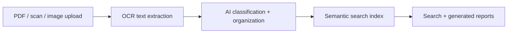

# AI Document Processing

**Document processing app: OCR for PDFs, scans and images, AI organization, semantic search and report generation.**

      

## Problem it solves

Scanned documents are unsearchable until someone types them up. This app extracts text with OCR, organizes documents with AI and makes the whole library searchable by meaning.

An AI-powered document processing SaaS platform that extracts text from PDFs, scans, and images using OCR. Organizes content intelligently with AI, enables semantic search across your document library, and generates AI-powered reports.

## Features
- PDF/image OCR
- Semantic search
- Document organization
- Batch processing
- AI report generation

## Tech Stack
TypeScript, React, FastAPI, OCR, Vector DB